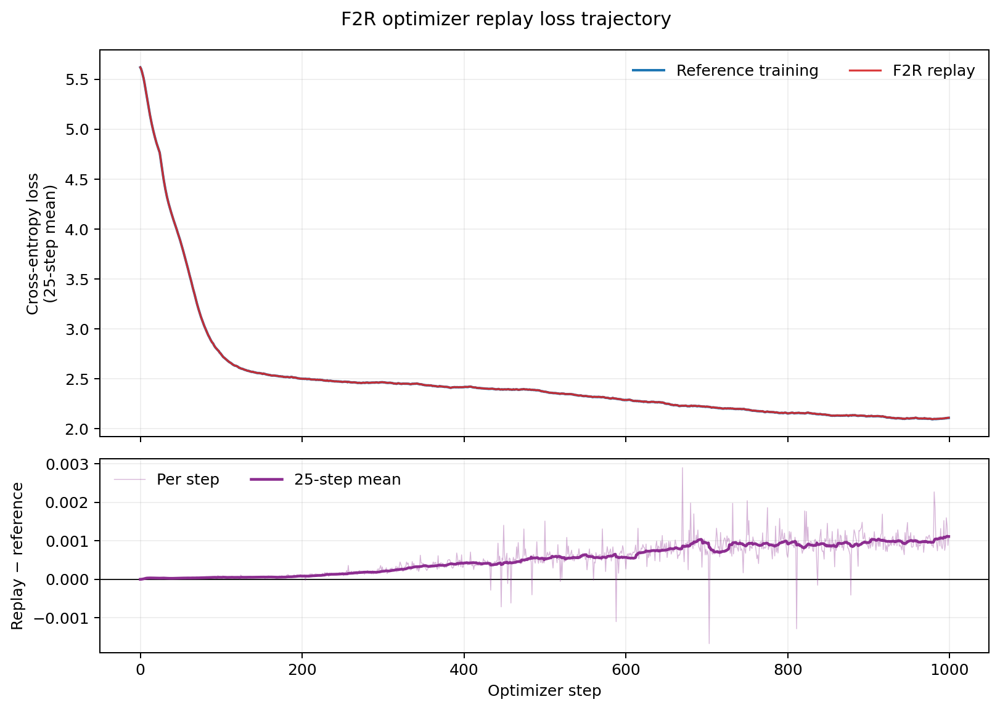

# F2R — rate-matched optimizer-sensitive allocation

F2R is the controlled follow-up to F2. It uses the same completed 1,000-step
`experiment_003` trace and performs one new causal encode. F1 and F2 were not
rerun. The result is a causal post-hoc evaluation because gradients came from a
completed trace; the same writer and allocator are also integrated and tested
inside the training loop.

## Hypothesis

F2 improved compression from F1's 3.447x to 3.993x, but its final-weight error
and output divergence became slightly worse. Its supposed optimizer constraint
was operationally inert: optimizer-proxy relative SSE averaged `8.82e-5` under
a `1e-4` limit, and only 82,176 of 4.8704B values received FP16. That result
confounded two changes—sensitivity-based placement and a 13.7% smaller
artifact—so it did not fairly test the placement signal.

F2R asks a narrower question: **at exactly F1's payload rate, does allocating
higher precision by F2's coarse Adam sensitivity improve optimizer replay and
the final predictive distribution?** The raw per-step relative-SSE ceiling
remains `1e-4`.

## Method

Each block exposes the same monotone frontier as F2:

1. seeded randomized-Hadamard int8;
2. direct FP16;
3. exact FP32.

For block `i`, let an adjacent upgrade cost `Delta b_i` bytes, reduce raw SSE by
`Delta d_i`, and have the decoder-synchronized sensitivity

```text
s_i,t = 1 / (sqrt(vbar_i,t-1) + epsilon)^2,
vbar_i,t = beta2 vbar_i,t-1 + (1-beta2) mean(ghat_i,t^2).
```

F2R starts each step at the cheapest point on every frontier. If this selection
violates the raw `1e-4` limit, a safety pass buys upgrades in descending
`Delta d_i / Delta b_i` order. It then spends the remaining rate in descending

```text
s_i,t Delta d_i / Delta b_i
```

order. Thus the second pass directly minimizes the diagonal Adam-error proxy
under a byte constraint instead of guessing another weighted-SSE threshold.
The prototype uses a heap over adjacent frontier moves. A production sharded
implementation can obtain the same thresholded selection with parallel
histograms or selection kernels rather than a model-wide heap.

The cumulative payload target through step `t` is

```text
T_t = (rho / 8) sum_(tau <= t) n_tau,
```

where `rho=9.27169990801577` payload bits/value is computed from F1's already
saved payload: `8 * 5,644,610,904 / 4,870,400,000`. At step `t`, the available
budget is `floor(T_t - A_(t-1))`, where `A` is actual cumulative payload. The
reservoir `R_t=T_t-A_t` carries fractional bytes and underspend from indivisible
blocks forward without delaying any gradient. It finishes at approximately
zero, and the total F2R payload equals F1's exactly.

The codec's persistent state is one float64 EMA per 16,384-value block plus two
rate counters. At one trillion parameters that EMA is about 488 MB globally,
or 0.0122% of a 4 TB FP32 gradient/model, and it remains local to existing
training shards. Temporary candidate frontiers are linear in the number of
blocks. The randomized-Hadamard work remains `O(N log B)` for block size `B`;
as with F1/F2, practical trillion-scale use requires fused accelerator kernels
and overlap with gradient sharding/I/O.

The optimizer-aware premise follows 1-bit Adam's evidence that adaptive
optimizer state changes what errors can safely be compressed
([Tang et al., 2021](https://proceedings.mlr.press/v139/tang21a.html)). APOLLO
provides independent evidence that coarse channel/tensor statistics can
approximate much finer Adam scaling
([Zhu et al., 2025](https://proceedings.mlsys.org/paper_files/paper/2025/file/437bc4ccafd3fc6d4289bd10940be42b-Paper-Conference.pdf)).
The inherited randomized transform follows the energy-spreading mechanism in
[EDEN](https://proceedings.mlr.press/v162/vargaftik22a.html) and
[QUIC-FL](https://arxiv.org/abs/2205.13341). F2R does not import those methods'
distributed-optimization objectives; all three representations remain
independently decodable archive records.

## Reproduction

```bash
PYTHONPATH=src \
OTS_EXPERIMENTS_DIR=/Volumes/agocdrive/gradient-research/experiments \
python -m ots_compression.compression.lossy_cli \
  --experiment experiment_003 \
  --prediction zero \
  --block-transform randomized_hadamard \
  --allocation rate_matched_optimizer \
  --relative-squared-error 1e-4 \
  --sensitivity-beta2 0.95 \
  --sensitivity-epsilon 1e-8 \
  --target-payload-bits-per-element 9.27169990801577 \
  --access-label causal-posthoc
```

Large artifacts are under
`<experiments>/experiment_003/lossy/ots_rht_adam_rate_matched_f2r/causal_posthoc/`.
They include the compressed stream, decoded gradients, every decoder
prediction, raw per-step telemetry, replayed final weights, the 1,000-point
loss curve, and held-out output metrics. The zero predictor is deliberate, so
its saved prediction trace contains zeros and has prediction R2 zero; retaining
it keeps the artifact schema compatible with future structural predictors.

## Compression results

| Measurement | F2R | F1 | F2 |
| --- | ---: | ---: | ---: |
| Payload bytes | 5,644,610,904 | 5,644,610,904 | 4,872,217,176 |
| Full artifact bytes | 5,654,330,049 | 5,654,329,196 | 4,881,928,084 |
| Compression ratio | 3.447169x | 3.447169x | 3.992568x |
| Gradient energy R2 | 0.999935095 | 0.999930143 | 0.999915968 |
| Gradient cosine | 0.999967549 | 0.999965073 | 0.999957987 |
| Relative SSE | 6.491e-5 | 6.986e-5 | 8.403e-5 |
| Int8 elements | 4.097924B | 4.104216B | 4.870318B |
| FP16 elements | 0.772476B | 0.763039B | 82,176 |
| FP32 elements | 0 | 3.146M | 0 |

F2R is only 853 full-artifact bytes larger than F1 (0.0000151%); the difference
is metadata, while block payloads match exactly. F2R reduces total raw SSE by
7.09% at that rate. It uses 9.44M more FP16 values than F1 while eliminating
F1's 3.15M FP32 values, illustrating why global allocation can dominate
independent block gates even before optimizer sensitivity is considered.

The reservoir ends at `5.7e-6` byte from zero. Only seven safety upgrades were
needed across all 1,000 steps; 58,945 upgrades spent the rate by the optimizer
proxy. Every step cleared the raw error limit. The proxy is now active rather
than slack: precision selection is driven by its marginal weighted-error score.

| Per-step measurement | Mean | Median | p05 | p95 |
| --- | ---: | ---: | ---: | ---: |
| Compression ratio | 3.44543x | 3.44550x | 3.44535x | 3.44551x |
| Compression latency | 291.95 ms | 285.21 ms | 265.73 ms | 340.20 ms |
| Throughput | 64.17 MiB/s | 65.14 MiB/s | 54.61 MiB/s | 69.92 MiB/s |
| Reconstruction R2 | 0.99993453 | 0.99992981 | 0.99991829 | 0.99996874 |
| Raw relative SSE | 6.547e-5 | 7.019e-5 | 3.126e-5 | 8.171e-5 |
| Optimizer-proxy relative SSE | 6.622e-5 | 6.769e-5 | 5.864e-5 | 6.939e-5 |

All 1,000 rows, including target/actual payload, reservoir, safety upgrades,
rate upgrades, fidelity, rate, and compression latency, are in `results.csv`.
Outer encode time was 348.33 s and decode time was 132.23 s. Mean codec latency
is 16.0% above F1's prototype and 15.4% below F2's; Python and system variance
make these directional measurements, not accelerator-throughput claims.

## Replay and final-model outputs

| Endpoint measurement | F2R | F1 | F2 |
| --- | ---: | ---: | ---: |
| Replay loss MAE | 5.415e-4 | 5.754e-4 | 5.967e-4 |
| Replay loss RMSE | 6.800e-4 | 7.058e-4 | 7.285e-4 |
| Maximum loss difference | 2.897e-3 | 2.863e-3 | 2.974e-3 |
| Final-weight cosine | 0.997667517 | 0.997588650 | 0.997551790 |
| Final-weight relative L2 | 0.0683986 | 0.0695681 | 0.0700972 |
| Label CE delta | +1.043e-3 | +1.098e-3 | +1.110e-3 |
| Reference-to-lossy KL | 8.624e-4 | 8.784e-4 | 9.080e-4 |
| Jensen-Shannon divergence | 2.834e-4 | 2.884e-4 | 2.982e-4 |
| Top-1 agreement | 99.7002% | 99.7032% | 99.6552% |
| Logit relative L2 | 27.8086% | 28.2482% | 28.4749% |

Against the rate-matched F1 control, F2R improves loss MAE by 5.90%, final
weight relative L2 by 1.68%, reference-to-lossy KL by 1.81%, JS by 1.73%, and
logit relative L2 by 1.56%. Top-1 agreement decreases by only 0.003 percentage
points, and maximum loss error increases 1.18%; the result is not a universal
endpoint win. The same 32 validation batches and 131,072 predictions were used.
The complete cross-entropy, bidirectional KL, JS, agreement, logit, and
probability row is in `final_model_outputs.csv`.



The upper panel shows why aggregate training loss alone can make F2R appear
nearly exact. The lower panel exposes accumulation: mean signed replay-minus-
reference loss is `+3.80e-5` over steps 0–99 and `+1.01e-3` over steps
900–999. The curves remain close, but their separation grows causally rather
than behaving like stationary zero-mean probe noise.

## Signed-error diagnosis

| Accumulation measurement | F2R | F1 | F2 |
| --- | ---: | ---: | ---: |
| Scalar error mean | +3.63e-12 | -5.36e-11 | +1.39e-11 |
| Scalar error RMS | 3.274e-6 | 3.396e-6 | 3.725e-6 |
| L2 of step-summed error | 0.22833 | 0.23667 | 0.25938 |
| Step-summed error / gradient L2 | 0.2663% | 0.2760% | 0.3025% |
| Cumulative error RMS per parameter | 1.035e-4 | 1.072e-4 | 1.175e-4 |

At equal rate, F2R reduces F1's cumulative error L2 by 3.52%. Its largest
accumulated error remains the token embedding, followed by early attention and
position-embedding tensors. The allocator improves the error distribution but
does not remove the same structural concentration. Detailed tensor rows are in
`trajectory_error.json`.

## What we learned and next decision

The controlled placement hypothesis is **partially accepted**. Once rate is
held fixed, coarse decoded-gradient Adam sensitivity improves nearly every
continuous replay/output metric and cumulative signed error. The effect is too
small to make the rotated-int8 lineage endpoint-safe: final weights are still
6.84% away and output KL remains `8.62e-4`, far worse than D/E controls.

Retain rate-matched sensitivity allocation as a component/control, but stop
tuning its scalar threshold. F3 should add decoder-synchronized rank-k tensor
subspaces so coherent spectral directions are represented separately from the
rotated noise-like residual, then feed subspace and residual candidates into
the same rate controller. This follows the evidence rather than attributing
all remaining error to bit placement: the largest accumulated errors are still
tensor-structured, and F2R has now given the block-scalar signal a fair test.
