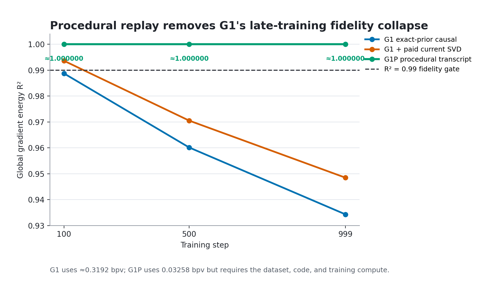
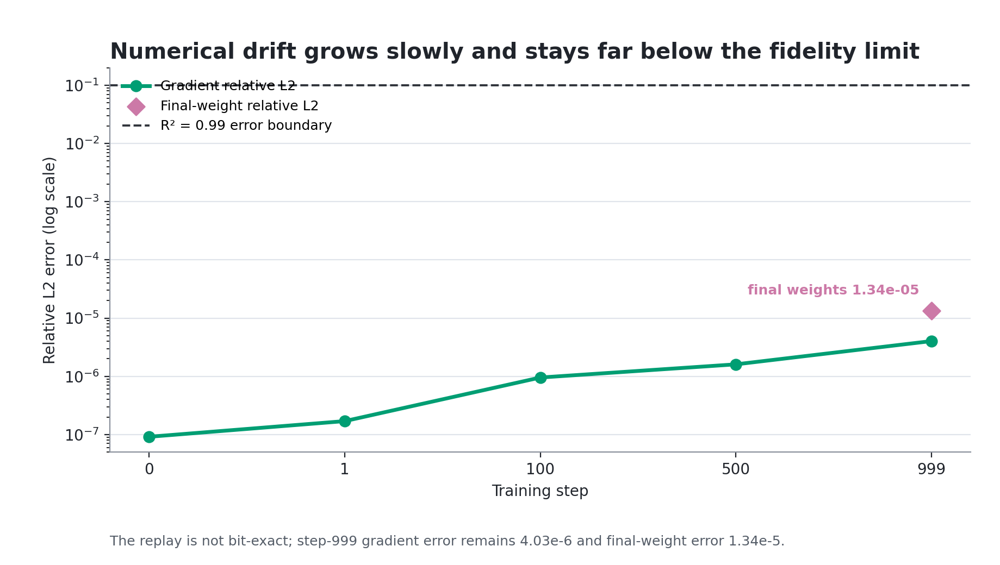

# G1P: procedural side-information control

## Hypothesis

G1 reached the 0.32-bit/value budget but its best paid structural frontier fell
from gradient energy `R2 = 0.993601` at step 100 to `0.970510` at step 500 and
`0.948499` at step 999. Its byte use did not decline, so the failure was caused
by late-training innovation rather than a shrinking rate allocation.

G1P tests the protocol-authorized exception: instead of predicting that
innovation from earlier gradients, store the initial model and exact minibatch
schedule, then regenerate each gradient by replaying forward, backward,
clipping, AdamW, and the scheduler against the external training dataset. The
hypothesis is that this procedural state remains synchronized enough to keep a
stable `R2 >= 0.99` across the full training horizon while staying below 0.32
bits per gradient value.

This is a **procedural training transcript with external side information**,
not a standalone gradient codec.

## Method

The actual `.otsg1p` ZIP stream contains:

- the 19,769,774-byte initial FP32 model;
- all 16,000 training block indices as explicit little-endian uint32 values,
  DEFLATE-coded to 42,652 bytes;
- a 1,992-byte contract containing the dataset-token hash, model, optimizer,
  scheduler, runtime, code revision, and payload hashes; and
- the 20,574-byte decoder source used for the retained endpoint run.

ZIP framing brings the real stream to 19,835,448 bytes. Labels are the next
tokens in the external dataset and cost zero transcript bytes. Dropout is zero,
and the stored schedule removes sampler RNG from decode, so no per-step RNG
payload is required. The decoder verifies the 10,951,563-token dataset by
SHA-256 before running.

The decoder starts from the included initial model, uses the explicit batch
indices, and executes all 1,000 training steps sequentially on the same Apple
MPS/PyTorch 2.8.0 environment class as the reference. Gradients are compared
with the exact trace at steps 0, 1, 100, 500, and 999. The run retains the final
model and evaluates it on the same 32 validation batches used by prior D--F
experiments. The scientific gate remains `R2 >= 0.99`; the separately approved
continuation abort is `R2 < 0.90`.

For random-access accounting, the experiment also serializes one actual
model+Adam+scheduler recovery keyframe after optimizer state exists. It costs
58,795,833 bytes. The sequential stream contains no intermediate keyframe.

## Rate and runtime

| Measurement | G1P |
| --- | ---: |
| Complete transcript | 19,835,448 B |
| Amortized bytes/step | 19,835.448 B |
| Bits/gradient value | **0.0325812** |
| FP32-gradient ratio | **982.161x** |
| Hard limit | 0.32 bpv / 100x |
| Sequential decode, 1,000 steps | 318.232 s |
| Effective decode throughput | 15.30 Mvalues/s |
| Recovery keyframe | 58,795,833 B |
| Additional keyframes within 0.32 bpv | 2 |

The initial model is 99.67% of the complete stream. Two additional recovery
keyframes plus the transcript still fit under the aggregate rate limit, but
fine-grained random access does not: each keyframe must include the two Adam
moment tensors as well as model and scheduler state.

## Gradient stability

| Step | Energy R2 | Cosine | Relative L2 | Max absolute error | Loss error |
| ---: | ---: | ---: | ---: | ---: | ---: |
| 0 | 0.999999999999992 | 0.999999999999996 | 9.14e-8 | 2.24e-8 | 0 |
| 1 | 0.999999999999971 | 0.999999999999986 | 1.70e-7 | 3.73e-8 | 0 |
| 100 | 0.999999999999093 | 0.999999999999592 | 9.52e-7 | 6.33e-8 | 0 |
| 500 | 0.999999999997426 | 0.999999999998726 | 1.60e-6 | 1.06e-7 | 2.38e-7 |
| 999 | **0.999999999983788** | 0.999999999991900 | 4.03e-6 | 2.18e-7 | 2.38e-7 |



*Figure 1. G1P eliminates the late-step collapse seen by both G1 structural
frontiers. The comparison is scientifically useful but not storage-equivalent:
G1P has access to the external dataset and performs training compute.*



*Figure 2. Same-host replay is not bit-identical, and its numerical error grows
over time. The step-999 gradient error and final-weight error nevertheless
remain four to five orders of magnitude below the `R2 = 0.99` error boundary.*

Every sampled gradient clears the gate, and the minimum observed R2 is
`0.999999999983788`. All tensors differ at some bits because MPS reductions are
not bitwise deterministic, but the mismatch remains numerical noise rather
than a fidelity failure.

## Endpoint result

| Endpoint measurement | G1P |
| --- | ---: |
| Final-weight energy R2 | 0.999999999820930 |
| Final-weight cosine | 0.999999999910465 |
| Final-weight relative L2 | 1.338e-5 |
| Label CE delta | -5.247e-9 |
| Reference-to-replay KL | 1.648e-12 |
| Jensen-Shannon divergence | 4.120e-13 |
| Top-1 agreement | **100.0000%** |
| Logit relative L2 | 4.356e-7 |

The held-out comparison covers 131,072 next-token predictions. The replayed
model is functionally indistinguishable from the reference at this resolution;
the small negative label-CE delta is floating-point noise, not an improvement
claim. Complete output metrics are in `final_model_outputs.csv`.

## Interpretation and decision

The hypothesis is accepted **for the same-host procedural side-information
contract**. This raises the stable sampled gradient ceiling from G1's late-step
`0.948499` to effectively 1.0 while using only one tenth of the permitted rate.
The result identifies where the missing information lives: the minibatch and
training computation regenerate gradient innovation that previous-gradient
structure cannot predict.

It does not rescue the gradient-only G1 method. The decoder requires the exact
external dataset, a matching repository revision, compatible numerical
kernels, the initial model, and roughly another training pass. It is sequential
unless expensive optimizer keyframes are added. Cross-hardware or cross-version
fidelity has not been established.

The next useful experiment is **G1PD**, a portability and correction test:
decode the same explicit transcript on a changed runtime/device, measure where
R2 first falls, and code only the state/gradient corrections needed to restore
`R2 >= 0.99` under the remaining 0.2874 bpv. That directly tests whether the
procedural win can survive outside a same-host numerical contract. G2's shared
gradient-only hyperdecoder remains unauthorized by G1's negative late-step
evidence.

## Reproduction

```bash
python -m iter_impl_search_code.experiments.G1P.algorithm \
  --experiment /Volumes/agocdrive/gradient-research/experiments/experiment_003 \
  --datasets-dir /Volumes/agocdrive/gradient-research/datasets \
  --steps 0,1,100,500,999 \
  --device mps \
  --abort-r2 0.90 \
  --transcript /Volumes/agocdrive/gradient-research/experiments/experiment_003/lossy/g1p/transcript.otsg1p \
  --replayed-model /Volumes/agocdrive/gradient-research/experiments/experiment_003/lossy/g1p/replayed_final_model.pt \
  --output iter_impl_search_code/experiments/G1P/results.csv \
  --summary iter_impl_search_code/experiments/G1P/summary.json

OTS_DATASETS_DIR=/Volumes/agocdrive/gradient-research/datasets \
python -m ots_compression.nn_training.final_eval_cli \
  --experiment /Volumes/agocdrive/gradient-research/experiments/experiment_003 \
  --replayed-model /Volumes/agocdrive/gradient-research/experiments/experiment_003/lossy/g1p/replayed_final_model.pt \
  --destination /Volumes/agocdrive/gradient-research/experiments/experiment_003/lossy/g1p/final_eval \
  --batches 32

python -m iter_impl_search_code.experiments.G1P.plot_results \
  --results iter_impl_search_code/experiments/G1P/results.csv \
  --summary iter_impl_search_code/experiments/G1P/summary.json \
  --g1-results iter_impl_search_code/experiments/G1/results.csv \
  --output-dir iter_impl_search_code/experiments/G1P
```

The 19.8 MB transcript, replayed model, and detailed held-out batch outputs
remain under the external experiment directory. The compact aggregate tables,
figures, implementation, and writeup are retained in git.
